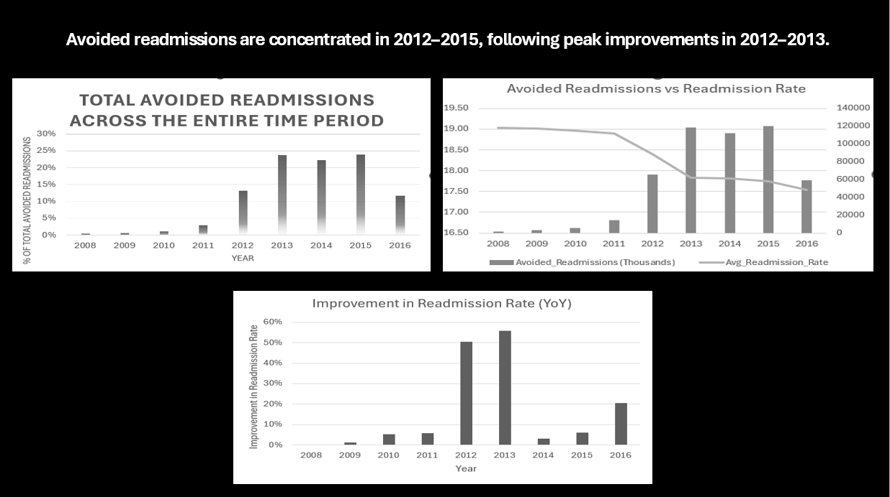
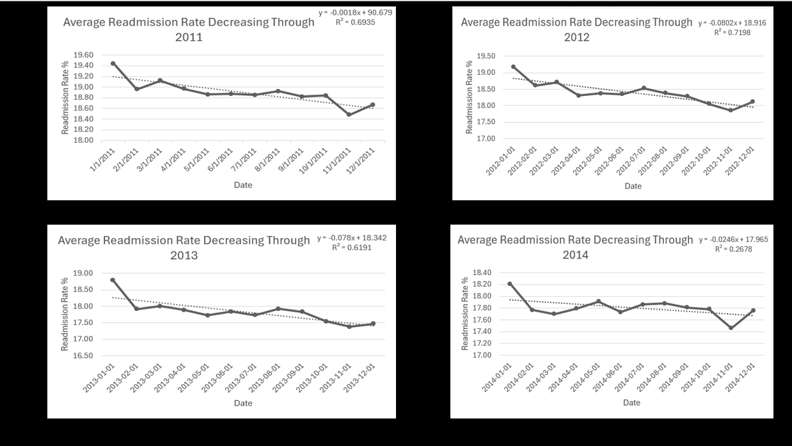
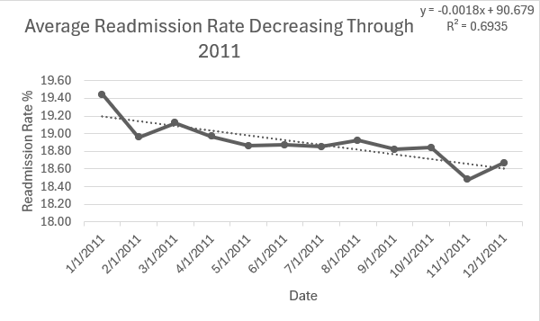
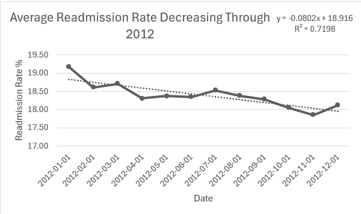
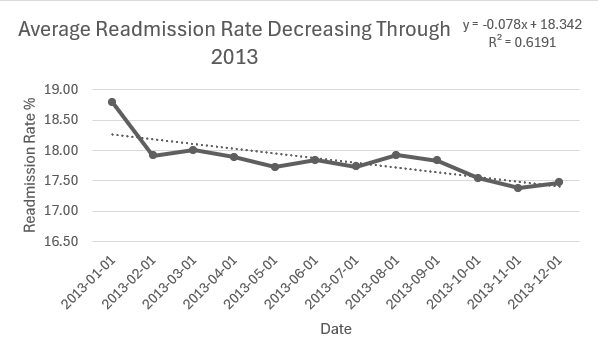

<div align="center">

# Medical Readmission Project
Austin Stewart MSDS 
</div>


## Tableau Visuals


## What I did

I looked at avoided readmissions and readmission rates over time to answer a simple question.

> Are higher avoided readmissions actually lowering the readmission rate.

I built a dashboard to track trends, compare the two metrics, and see where the biggest changes happen.

---

## Data Storage

I stored the data in a SQL database after taking it from the initial CSV files and loading it.


---

## Data Cleaning

I used Excel to do some data cleaning before making visuals by using the LEFT and RIGHT functions to extract text into other columns instead of clicking repeatedly.


---

## Dashboard

I built a dashboard to visualize avoided readmissions and compare them to the readmission rate over time.



---

## What the data shows

I am working with two main metrics.

Avoided readmissions in thousands.

Average readmission rate.

The data is monthly, which allows me to analyze both short term changes and long term trends.

---

## What I found

### 1. Most avoided readmissions happen between 2012 and 2015.

Avoided readmissions are very low from 2008 to 2011.

They increase sharply starting in 2012, peak around 2013 to 2015, and then drop in 2016.

This shows most of the impact is concentrated in a short period.

---

### 2. The readmission rate steadily goes down.

The readmission rate starts around 19 percent and slowly drops each year.

The biggest drop happens between 2011 and 2013.

After that, it keeps going down, but more slowly.

---

### 3. The biggest improvements happen in 2012 and 2013.

When I look at year over year improvement, 2012 shows a large jump and 2013 is the highest improvement point.

After 2013, improvements get smaller.

This lines up with the spike in avoided readmissions.

---

### 4. There is a clear shift around 2012.

Before 2012, there were low avoided readmissions and very small improvements.

After 2012, I found that avoided readmissions increase quickly and I found that the readmission rate drops faster.

---

### 5. 2016 does not follow the same pattern.

Avoided readmissions drop in 2016.

But the readmission rate still goes down and improvement is still positive.

So I ask.

> If avoided readmissions are dropping, what is still pushing the rate down.

This suggests avoided readmissions are not the only driver and other factors may also be contributing.

---

## R² Values




```sql
CREATE ALGORITHM=UNDEFINED DEFINER=`root`@`localhost` SQL SECURITY DEFINER VIEW `avg_monthly_readmit_rate_2011` AS 
select 
str_to_date(`ffs-medicare-30-day-readmission-rate-puf`.`Service_Month_Date`,'%Y-%m-%d') AS `Service_Date`,
avg(`ffs-medicare-30-day-readmission-rate-puf`.`Readmission_Rate`) AS `Avg_Readmission_Rate_2011`
from `ffs-medicare-30-day-readmission-rate-puf`
where year(str_to_date(`ffs-medicare-30-day-readmission-rate-puf`.`Service_Month_Date`,'%Y-%m-%d')) = 2011
group by `Service_Date`
order by `Service_Date`;
````

```sql
CREATE ALGORITHM=UNDEFINED DEFINER=`root`@`localhost` SQL SECURITY DEFINER VIEW `avg_monthly_readmit_rate_2012` AS 
select 
str_to_date(`ffs-medicare-30-day-readmission-rate-puf`.`Service_Month_Date`,'%Y-%m-%d') AS `Service_Date`,
avg(`ffs-medicare-30-day-readmission-rate-puf`.`Readmission_Rate`) AS `Avg_Readmission_Rate_2012`
from `ffs-medicare-30-day-readmission-rate-puf`
where year(str_to_date(`ffs-medicare-30-day-readmission-rate-puf`.`Service_Month_Date`,'%Y-%m-%d')) = 2012
group by `Service_Date`
order by `Service_Date`;
```

```sql
CREATE ALGORITHM=UNDEFINED DEFINER=`root`@`localhost` SQL SECURITY DEFINER VIEW `avg_monthly_readmit_rate_2013` AS 
select 
str_to_date(`ffs-medicare-30-day-readmission-rate-puf`.`Service_Month_Date`,'%Y-%m-%d') AS `Service_Date`,
avg(`ffs-medicare-30-day-readmission-rate-puf`.`Readmission_Rate`) AS `Avg_Readmission_Rate_2013`
from `ffs-medicare-30-day-readmission-rate-puf`
where year(str_to_date(`ffs-medicare-30-day-readmission-rate-puf`.`Service_Month_Date`,'%Y-%m-%d')) = 2013
group by `Service_Date`
order by `Service_Date`;
```

```sql
CREATE ALGORITHM=UNDEFINED DEFINER=`root`@`localhost` SQL SECURITY DEFINER VIEW `avg_monthly_readmit_rate_2014` AS 
select 
str_to_date(`ffs-medicare-30-day-readmission-rate-puf`.`Service_Month_Date`,'%Y-%m-%d') AS `Service_Date`,
avg(`ffs-medicare-30-day-readmission-rate-puf`.`Readmission_Rate`) AS `Avg_Readmission_Rate_2014`
from `ffs-medicare-30-day-readmission-rate-puf`
where year(str_to_date(`ffs-medicare-30-day-readmission-rate-puf`.`Service_Month_Date`,'%Y-%m-%d')) = 2014
group by `Service_Date`
order by `Service_Date`;
```

I’m using R² to understand how consistent the trend is over time. A higher R² means the trendline explains the data well, while a lower R² means the data is more scattered and less predictable.

In 2011, the R² is around 0.69, which shows the downward trend is fairly consistent, but there is still some variation.



In 2012, the R² increases to about 0.72, which is the strongest trend and means the decrease in readmission rates is the most consistent and predictable.



In 2013, the R² drops to around 0.62, which means the trend is still there, but there is more variability.



In 2014, the R² drops to about 0.27, which means the linear trend is not explaining much of the data and suggests other factors are influencing the rate.

---

## Why I think this matters

The data shows that improvements are not evenly spread over time.

Most of the change happens in a few key years.

If I only looked at totals, I would miss that.

I focus on when changes happen, how strong the changes are, and if the changes stay consistent.

---

## What I would do next

I would add more data like hospital type or region.

I would test the relationship between the two metrics.

I would build a simple forecast.

I would look into what changed around 2012.

---

## Skills I used

I used time series analysis, reading trends over time, comparing multiple metrics, finding shifts in behavior, and data storytelling.

I also reviewed 10 years of Data Storytelling experience in 8 minutes.

[https://www.youtube.com/watch?v=o-eP6E2yGG8](https://www.youtube.com/watch?v=o-eP6E2yGG8)

---

## Tools I used

I used Excel for building charts and analysis.

I used Tableau for making dashboards.

I used PowerPoint for visual design.

I used SQL for data analysis and querying.

---

## SQL Analysis Layer

I built a set of SQL views to support everything in the dashboard.

Instead of writing one large query, I broke the logic into smaller pieces so I can reuse them and understand exactly what each part is doing.

---

## Trend Analysis

```sql
CREATE ALGORITHM=UNDEFINED DEFINER=`root`@`localhost` SQL SECURITY DEFINER VIEW `average_monthly_readmit` AS 
select 
case t.Month_Num 
when 1 then 'January' 
when 2 then 'February' 
when 3 then 'March' 
when 4 then 'April' 
when 5 then 'May' 
when 6 then 'June' 
when 7 then 'July' 
when 8 then 'August' 
when 9 then 'September' 
when 10 then 'October' 
when 11 then 'November' 
when 12 then 'December' 
end AS Service_Month_Name,
avg(t.Readmission_Rate) AS Avg_Readmission_Rate
from (
select 
month(Service_Month_Date) AS Month_Num,
Readmission_Rate
from `ffs-medicare-30-day-readmission-rate-puf`
) t
group by t.Month_Num
order by t.Month_Num;
```

```sql
CREATE ALGORITHM=UNDEFINED DEFINER=`root`@`localhost` SQL SECURITY DEFINER VIEW `yearly_average_readmits` AS 
select 
year(Service_Month_Date) AS Year,
avg(Readmission_Rate) AS Avg_Readmission_Rate
from `ffs-medicare-30-day-readmission-rate-puf`
group by year(Service_Month_Date)
order by Year;
```

---

## Change Over Time

```sql
CREATE ALGORITHM=UNDEFINED DEFINER=`root`@`localhost` SQL SECURITY DEFINER VIEW `mom_change` AS 
select 
Service_Month_Date,
Index_Stays,
Readmission_Rate,
(Index_Stays - lag(Index_Stays) over (order by Service_Month_Date)) AS MoM_Volume_Change,
(Readmission_Rate - lag(Readmission_Rate) over (order by Service_Month_Date)) AS MoM_Rate_Change
from `ffs-medicare-30-day-readmission-rate-puf`
order by Service_Month_Date;
```

```sql
CREATE ALGORITHM=UNDEFINED DEFINER=`root`@`localhost` SQL SECURITY DEFINER VIEW `yoy_change` AS 
select 
Service_Month_Date,
Readmission_Rate,
(Readmission_Rate - lag(Readmission_Rate,12) over (order by Service_Month_Date)) AS YoY_Change
from `ffs-medicare-30-day-readmission-rate-puf`
order by Service_Month_Date;
```

---

## Impact Metrics

```sql
CREATE ALGORITHM=UNDEFINED DEFINER=`root`@`localhost` SQL SECURITY DEFINER VIEW `baseline_rate` AS 
select 
avg(Readmission_Rate) AS Baseline_Rate
from `ffs-medicare-30-day-readmission-rate-puf`
where year(Service_Month_Date) = (
select min(year(Service_Month_Date)) 
from `ffs-medicare-30-day-readmission-rate-puf`
);
```

```sql
CREATE ALGORITHM=UNDEFINED DEFINER=`root`@`localhost` SQL SECURITY DEFINER VIEW `avoided_readmissions` AS 
select 
year(Service_Month_Date) AS Year,
sum(Index_Stays) AS Index_Stays,
avg(Readmission_Rate) AS Readmission_Rate,
(sum(Index_Stays) * (select Baseline_Rate from baseline_rate) / 100) AS Expected_Readmits_At_Baseline,
sum(Readmission_Stays) AS Actual_Readmits,
((sum(Index_Stays) * (select Baseline_Rate from baseline_rate) / 100) - sum(Readmission_Stays)) AS Avoided_Readmissions
from `ffs-medicare-30-day-readmission-rate-puf`
group by year(Service_Month_Date)
order by Year;
```

```sql
CREATE ALGORITHM=UNDEFINED DEFINER=`root`@`localhost` SQL SECURITY DEFINER VIEW `cumulative_readmits_avoided` AS 
select 
Service_Month_Date,
sum(((Index_Stays * (select Baseline_Rate from baseline_rate) / 100) - Readmission_Stays)) 
over (order by Service_Month_Date) AS Cumulative_Avoided_Readmissions
from `ffs-medicare-30-day-readmission-rate-puf`
order by Service_Month_Date;
```

---

## Stability and Variation

```sql
CREATE ALGORITHM=UNDEFINED DEFINER=`root`@`localhost` SQL SECURITY DEFINER VIEW `readmission_rate_rolling_volatility` AS 
select 
Service_Month_Date,
std(Readmission_Rate) over (
order by Service_Month_Date 
rows between 11 preceding and current row
) AS Rolling_12M_Volatility
from `ffs-medicare-30-day-readmission-rate-puf`;
```

---

## Additional Analysis

```sql
CREATE ALGORITHM=UNDEFINED DEFINER=`root`@`localhost` SQL SECURITY DEFINER VIEW `month_over_month_change` AS 
select 
Service_Month_Date,
Readmission_Rate,
(Readmission_Rate - lag(Readmission_Rate) over (order by Service_Month_Date)) AS MoM_Change
from `ffs-medicare-30-day-readmission-rate-puf`
order by Service_Month_Date;
```

```sql
CREATE ALGORITHM=UNDEFINED DEFINER=`root`@`localhost` SQL SECURITY DEFINER VIEW `readmit_descriptive_stats` AS 
select 
avg(Readmission_Rate) AS Overall_Avg_Rate,
min(Readmission_Rate) AS Min_Rate,
max(Readmission_Rate) AS Max_Rate,
std(Readmission_Rate) AS StdDev_Rate
from `ffs-medicare-30-day-readmission-rate-puf`;
```

```sql
CREATE ALGORITHM=UNDEFINED DEFINER=`root`@`localhost` SQL SECURITY DEFINER VIEW `rolling_six_month_avg` AS 
select 
Service_Month_Date,
Readmission_Rate,
avg(Readmission_Rate) over (
order by Service_Month_Date 
rows between 5 preceding and current row
) AS Rolling_6M_Avg
from `ffs-medicare-30-day-readmission-rate-puf`
order by Service_Month_Date;
```

```sql
CREATE ALGORITHM=UNDEFINED DEFINER=`root`@`localhost` SQL SECURITY DEFINER VIEW `rolling_three_month_readmit_rate` AS 
select 
Service_Month_Date,
Readmission_Rate,
avg(Readmission_Rate) over (
order by Service_Month_Date 
rows between 2 preceding and current row
) AS Rolling_3M_Avg
from `ffs-medicare-30-day-readmission-rate-puf`
order by Service_Month_Date;
```

```sql
CREATE ALGORITHM=UNDEFINED DEFINER=`root`@`localhost` SQL SECURITY DEFINER VIEW `seasonality` AS 
select 
t.Month_Name,
t.Avg_Readmission_Rate,
(t.Avg_Readmission_Rate - t.Overall_Avg) AS Diff_From_Overall
from (
select 
monthname(Service_Month_Date) AS Month_Name,
avg(Readmission_Rate) AS Avg_Readmission_Rate,
(select avg(Readmission_Rate) from `ffs-medicare-30-day-readmission-rate-puf`) AS Overall_Avg
from `ffs-medicare-30-day-readmission-rate-puf`
group by monthname(Service_Month_Date)
) t
order by t.Avg_Readmission_Rate desc;
```

```sql
CREATE ALGORITHM=UNDEFINED DEFINER=`root`@`localhost` SQL SECURITY DEFINER VIEW `total_avoided_readmits` AS 
select 
sum(((Index_Stays * (select Baseline_Rate from baseline_rate) / 100) - Readmission_Stays)) AS Total_Avoided_Readmissions
from `ffs-medicare-30-day-readmission-rate-puf`;
```

```sql
CREATE ALGORITHM=UNDEFINED DEFINER=`root`@`localhost` SQL SECURITY DEFINER VIEW `year_month_index_stays` AS 
select 
date_format(Service_Month_Date,'%Y-%m') AS YearMonth,
Index_Stays
from `ffs-medicare-30-day-readmission-rate-puf`
order by Service_Month_Date;
```

```sql
CREATE ALGORITHM=UNDEFINED DEFINER=`root`@`localhost` SQL SECURITY DEFINER VIEW `yoy_change_year` AS 
select 
t.year,
t.avg_readmission_rate,
(t.avg_readmission_rate - lag(t.avg_readmission_rate,1) over (order by t.year)) AS YoY_Change
from (
select 
year(Service_Month_Date) AS year,
avg(Readmission_Rate) AS avg_readmission_rate
from `ffs-medicare-30-day-readmission-rate-puf`
group by year(Service_Month_Date)
) t
order by t.year;
```

```sql
CREATE ALGORITHM=UNDEFINED DEFINER=`root`@`localhost` SQL SECURITY DEFINER VIEW `hrrp_periods` AS 
select 
t.Policy_Period,
avg(t.Readmission_Rate) AS Avg_Readmission_Rate,
avg(t.Index_Stays) AS Avg_Index_Stays
from (
select 
Service_Month,
Index_Stays,
Readmission_Stays,
Readmission_Rate,
Service_Month_Date,
case 
when Service_Month_Date < '2012-10-01' then 'Pre HRRP'
else 'Post HRRP'
end AS Policy_Period
from `ffs-medicare-30-day-readmission-rate-puf`
) t
group by t.Policy_Period;
```

---
## Recommendations 
  -- This is where I'm going to put my recommendations based on the data. 

## Why I built it this way

I did not want one large query that does everything.

I wanted clear logic, reusable pieces, and the ability to debug each step.

This makes it easier to trust the results and extend the analysis later.


<div align="center">

## References

Centers for Medicare & Medicaid Services. (n.d.). *Medicare hospital quality data*. https://data.cms.gov  

Barousse, L. (2023). *Excel for data analytics – Full course* [Video]. YouTube. https://www.youtube.com/watch?v=pCJ15nGFgVg  

Data with Baraa. (2023). *SQL full course for beginners (30 hours) – From zero to hero* [Video]. YouTube. https://www.youtube.com/watch?v=SSKVgrwhzus  

Microsoft. (n.d.). *Excel functions (by category)*. https://support.microsoft.com/excel  

Tableau Software. (n.d.). *Tableau documentation*. https://help.tableau.com  

MySQL. (n.d.). *MySQL 8.0 reference manual*. https://dev.mysql.com/doc/  

</div>
