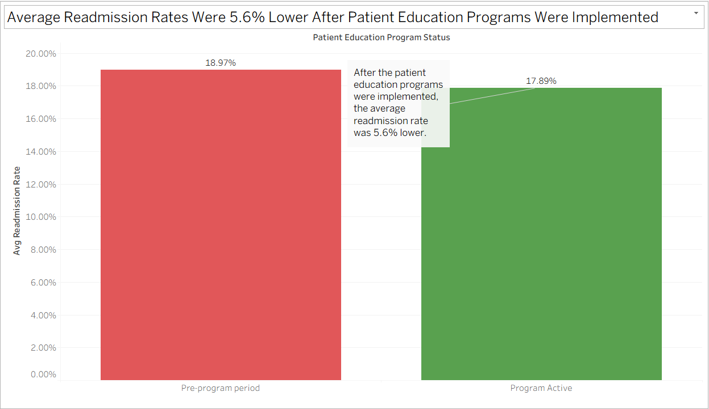
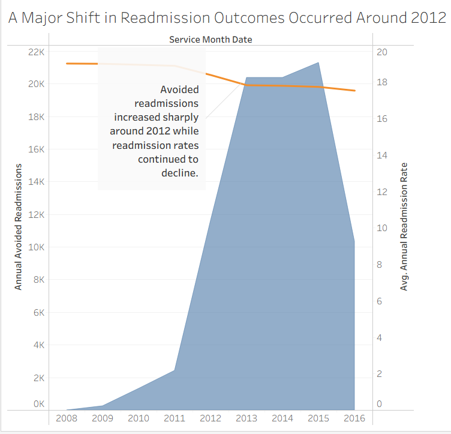
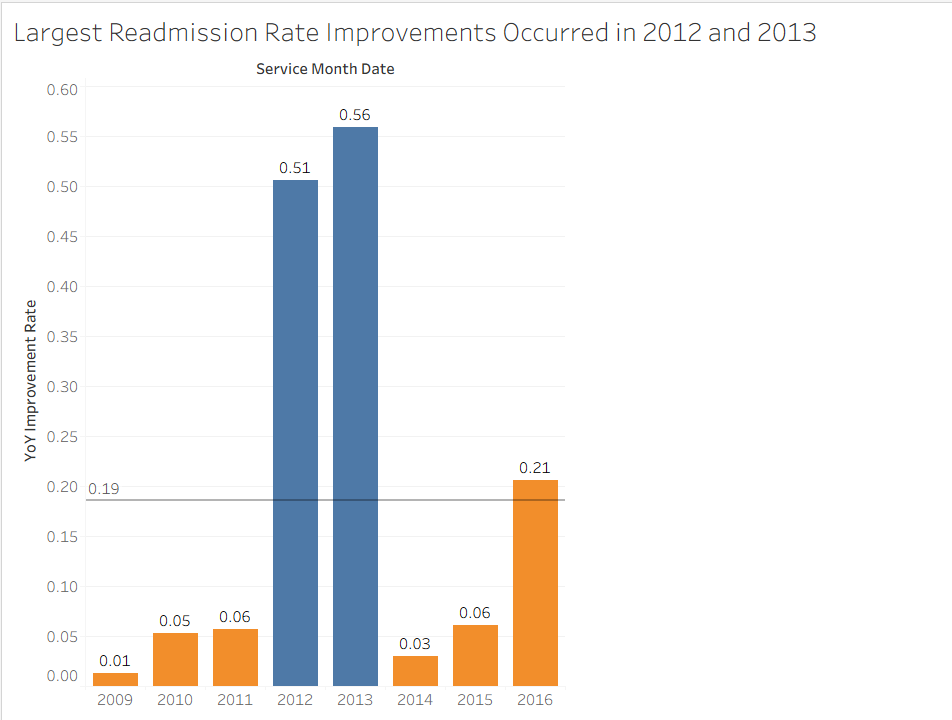
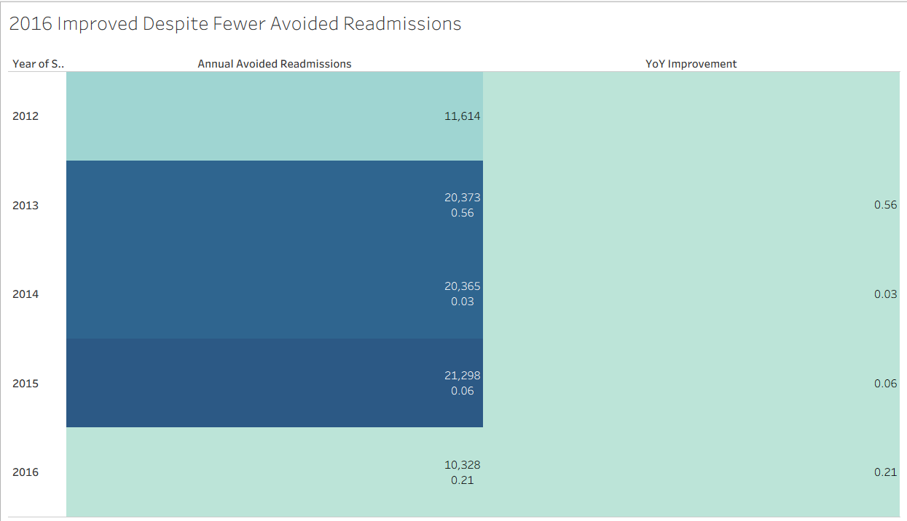
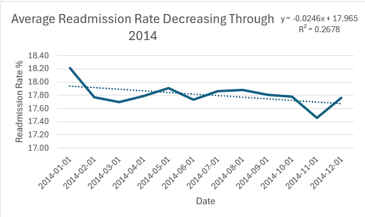

# Medical Readmission Project

### Austin Stewart, MSDS

Video Explanation Of The Project
I'll add the video link here. 

## Quick Navigation

* [Project Overview](#project-overview)
* [Project Stack](#project-stack)
* [Project Files](#project-files)
* [Key Findings](#key-findings)
* [Business Recommendations](#business-recommendations)
* [Dashboard](#dashboard)
* [Tableau Visuals](#tableau-visuals)
* [What I Did](#what-i-did)
* [Metrics](#Metrics)
* [Data Quality Issues](#data-quality-issues)
* [Data Cleaning Process](#data-cleaning-process)
* [Issues / Resolutions](#issues--resolutions)
* [Data Cleaning](#data-cleaning)
* [Data Storage](#data-storage)
* [SQL Analysis Layer](#sql-analysis-layer)
* [Why I Built It This Way](#why-i-built-it-this-way)
* [R² Values](#r²-values)
* [Why I Think This Matters](#why-i-think-this-matters)
* [What I Would Do Next](#what-i-would-do-next)
* [Skills I Used](#skills-i-used)
* [Tools I Used](#tools-i-used)
* [SQL Views](#sql-views)
* [Tableau Workbooks](#tableau-workbooks)
* [References](#references)

# Project Overview

I analyzed hospital readmission data from 2008 through 2016 to identify trends, seasonal patterns, and periods of accelerated improvement. My project demonstrates data cleaning, SQL analysis, Tableau dashboard development, and data storytelling.

# Tools Used

SQL

Tableau

Excel

Dataset: CMS Hospital Readmission Data (2008–2016) with additional data quality issues introduced to illustrate data cleaning.

# Project Files

## SQL Views

https://github.com/austinstewartmsda-stack/Medical-Readmissions/blob/main/SQL/SQL_Views.sql

## Tableau Workbooks

https://github.com/austinstewartmsda-stack/Medical-Readmissions/tree/main/Tableau

# Key Findings

### 1. Pre/Post Education Program Implementation

I found that the readmission rate went down from 18.97% before the patient education programs started to 17.90% while the programs were active. This means the readmission rate was about 5.6% lower during the program period.

Using the rate before the programs started, I estimated that about 452,000 fewer people returned to the hospital during the program period. If each hospital return costs about $10,000 to $15,000, this could represent about $4.5 billion to $6.8 billion in potential cost savings.

These estimates are based on the readmission rate before the programs started and are intended to provide business context.

### 2. I Found A Clear Shift Around 2012

Before 2012, I found that readmission rates changed slowly and estimated fewer readmissions stayed low.

Beginning in 2012, I found that estimated fewer readmissions increased quickly while readmission rates continued to go down. This happened during the same time period as the patient education programs in the dataset, including diabetes management and weight management programs.

### 3. I Found The Biggest Improvements In 2012 And 2013

When I looked at year over year improvement, I found a large increase in 2012. I found that 2013 had the highest improvement in the dataset. After 2013, the improvements became smaller. This matched the increase in estimated fewer readmissions.

### 4. I Found That The Readmission Rate Continued To Go Down

I found that the readmission rate started at about 19 percent and slowly decreased throughout the study period. The largest drop happened between 2011 and 2013. After that, the rate continued to go down, but at a slower pace.

### 5. I Found That Most Estimated Fewer Readmissions Happened Between 2012 And 2015

I found that estimated fewer readmissions were low from 2008 through 2011.

They increased quickly beginning in 2012, reached their highest levels between 2013 and 2015, and then decreased in 2016.

This showed me that most of the improvement happened during a short period of time.

### 6. I Found That 2016 Did Not Follow The Same Pattern

I found that estimated fewer readmissions decreased in 2016, but the readmission rate continued to improve and year over year improvement remained positive.

This showed me that estimated fewer readmissions may not be the only reason the readmission rate continued to go down. Other factors may also have helped improve the rate.

# Business Recommendations

### Recommendation 1

Continue supporting patient education and chronic disease management programs because they were associated with lower readmission rates during the study period. During the program period, the readmission rate was 5.6% lower and I estimated about 452,000 fewer readmissions.

### Recommendation 2

Review differences between the highest readmission period (19.53% in January 2009) and the lowest readmission period (17.30% in April 2016) to identify opportunities for further improvement.

# What I Did

The cleaned dataset contains 101 monthly observations from January 2008 to May 2016.

I analyzed hospital readmission rates between 2008 and 2016 to identify trends, seasonal patterns, and periods of accelerated improvement.

I also developed an estimated fewer readmissions metric to measure the impact of declining readmission rates over time.

# Metrics

I am working with two main metrics:

1. Estimated Avoided Readmissions in thousands.

2. Average readmission rate.

The data is monthly, which allows me to analyze both short term changes and long term trends.

# Data Quality Issues

The data was dirty when I decided to start the project. I identified some common issues within the data.

* Duplicate records
* Text standardization issues
* Numeric fields imported as strings
* Non business metadata columns
* Spacing issues
* Inconsistent date formats
* Incorrect labeling of program implementation and continuation after 2015

# Data Cleaning Process

This showed me that I needed to perform some data cleaning. I removed duplicate records, standardized date formats, converted numeric fields stored as text into numeric data types, removed unnecessary metadata columns, standardized text values, and removed leading and trailing whitespace.

# Issues / Resolutions

### Duplicate rows

I removed duplicate records.

### Numeric fields stored as text

I converted them to numerics.

### Date inconsistencies

I standardized them to a consistent format.

### Leading/trailing spaces

I used TRIM functions to eliminate the whitespace.

### Incorrect labeling of program implementation and continuation

The patient education field was not labeled correctly after 2015. I corrected the labels so the program status remained consistent in the dataset.

# Data Cleaning

I used Excel functions such as LEFT, RIGHT, and TRIM to standardize text fields, clean inconsistent values, and prepare the dataset for analysis.

# Data Validation

After cleaning, I checked the row count, looked for duplicates and missing values, confirmed the data types, and reviewed the data to make sure that my code had worked properly.

The data cleaning and validation code can be found here. 
https://github.com/austinstewartmsda-stack/Medical-Readmissions/blob/main/SQL/SQL_Data_Cleaning.sql

# Data Storage

I loaded the cleaned CSV data into a SQL database and used SQL views for trend analysis, seasonality analysis, rolling averages, year-over-year comparisons, and estimated readmission calculations.

# SQL Analysis Layer

I built a set of SQL views to support everything in the dashboard.

Instead of writing one large query, I broke the logic into smaller pieces so I can reuse them and understand exactly what each part is doing.

# Why I Built It This Way

I did not want one large query that does everything.

I wanted clear logic, reusable pieces, and the ability to debug each step.

This makes it easier to trust the results and extend the analysis later.

# R² Values

I’m using R² to understand how consistent the trend is over time. A higher R² means the trendline explains the data well, while a lower R² means the data is more scattered and less predictable.

In 2011, the R² is around 0.69, which shows the downward trend is fairly consistent, but there is still some variation.

In 2012, the R² increases to about 0.72, which is the strongest trend and means the decrease in readmission rates is the most consistent and predictable.

In 2013, the R² drops to around 0.62, which means the trend is still there, but there is more variability.

In 2014, the R² drops to about 0.27, which means the linear trend is not explaining much of the data and suggests other factors are influencing the rate.

# Why I Think This Matters

The data shows that improvements are not evenly spread over time. Most of the changes happen in specific years. If I only looked at totals, I would miss that. I decided to focus on when changes happen, how strong the changes are, and if the changes stay consistent.

# What I Would Do Next

1. I would add more data like hospital type or region.

2. I would test the relationship between the two metrics.

3. I would build a simple forecast.

4. I would look into what changed around 2012.

# Skills I Used

I used time series analysis, reading trends over time, comparing multiple metrics, finding shifts in behavior, and data storytelling.

# Tools I Used

I used Excel for building charts and analysis.

I used Tableau for making dashboards.

I used SQL for data analysis and querying.

# SQL Views

My SQL can be viewed here.

https://github.com/austinstewartmsda-stack/Medical-Readmissions/blob/main/SQL/SQL_Views.sql

# Tableau Workbooks

My Tableau notebooks can be viewed here.

https://github.com/austinstewartmsda-stack/Medical-Readmissions/tree/main/Tableau

# References

Centers for Medicare & Medicaid Services. (n.d.). *Medicare hospital quality data.*

https://data.cms.gov

